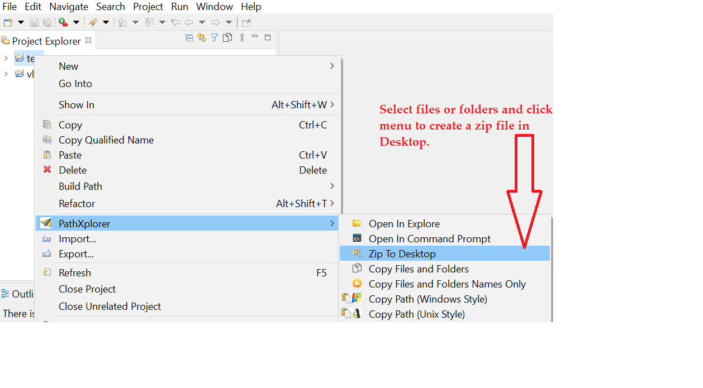

 

PathXplorer Eclipse Utility Plugin for swift developement
==========================================================================================

Introduction
============
**Path Xplorer** is an eclipse utility plugin which provides some handlful utilities useful for swift development.

Advantages of Path Xplorer
============================

* **Open files or folders in Windows Explorer (Multi Selection)**
* **Open files or folders in Windows command prompt (Multi Selection)**
* **Copy File Path (Windows Style , Multi Selection)**
* **Copy File Path (Unix Style , Multi Selection)**
* **Copy Files and Folders to ClipBoard (Multi Selection)**
* **Copy Files and Folders names only to ClipBoard (Multi Selection)**
* **Open in Windows Command Prompt (Multi Selection)**
* **Send Files to Desktop**
* **Zip files and send to Desktop**
* **Open Windows command from a handy icon from console view**
* **Copy Files and Folders to ClipBoard (Multi Selection) from Project Explore View**

Technology Stack
================
The following framework/s and tool/s have been used in this current sample application.

<table border="1">
  <tr>
    <th>Name</th>
    <th>Version</th> 
  </tr>
  <tr>
    <td>Java</td>
    <td>1.8</td> 
  </tr>
  <tr>
    <td>Eclipse framework (SWT & JFace) with Oxygen</td>
    <td>3.0.9</td> 
  </tr>
  <tr>
    <td>Eclipse tycho</td>
    <td>1.2.0</td> 
  </tr>
  <tr>
    <td>Apache Maven</td>
    <td>3.6.3</td> 
  </tr>
</table>

How to use it ?
===============
Install using the below button.

<table style="border: none; width:100%">
  <tbody>
    <tr style="border:none;">
      <td style="vertical-align: middle; padding-top: 10px; border: none;">
        
      </td>
      <td style="vertical-align: middle; text-align: left; border: none;">
        ← Drag it to your eclipse workbench to install!</td>
    </tr>
  </tbody>
</table>

or 

use `https://dl.bintray.com/debajava/pathxplorer/` in Help -> Install New Software ... Dialog.

or

Please Download  latest zip file directly or you can also download from the **download** directory of this repository.

Download the zip file and install as in Help -> Install New Software -> Add... -> Archive... Dialog.

See the screenshots give below to know its usage.

* **PathXplorer submenu available by making right click**

* **To open files and folders in Windows explorer or to open the file in windows folder**

* **To open files and folders in Windows command prompt**

* **To create a zip file in desktop by selecting files and folders**

* **To copy files or folders and paste in a folder**

* **To copy files or folders names only and paste in any text editor**

* **To copy files or folders path in windows style only and paste in any text editor**

* **To copy files or folders path in unix style only and paste in any text editor**

* **To select files only and send to desktop**

* **Copy Files and Folders to ClipBoard (Multi Selection) from Project Explore View**

* **Open Windows command from a handy icon from console view**

How to build this project
=========================
This is an eclipse plugin development project developed using java 1.8. Follow the steps mentioned below.

* Clone the project or simply download the project and unzip it.
* Go to the directory in command prompt.
* Use the command `mvnw clean package`.
* **Download** folder contains the installable plugin as a zip file..
* **latest-2020** contains the installable plugin.

Bugs and Feedback
=================
There may be some bugs or error, please feel free to report to me at deba.java@gmail.com

Contributor
==========
@Author : **Debadatta Mishra (PIKU)** [Know me](https://about.me/debadattamishra)

Conclusion
==========
Hope you have enjoyed my small utility plugin, try to learn and explore more and share with all.

